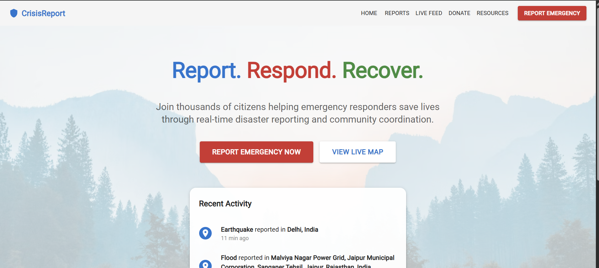
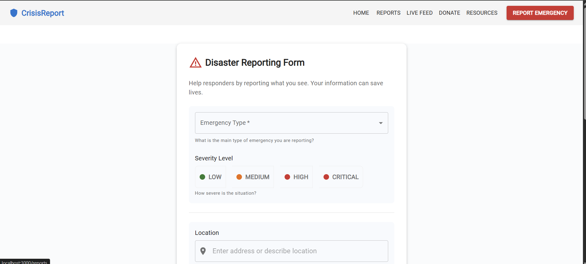
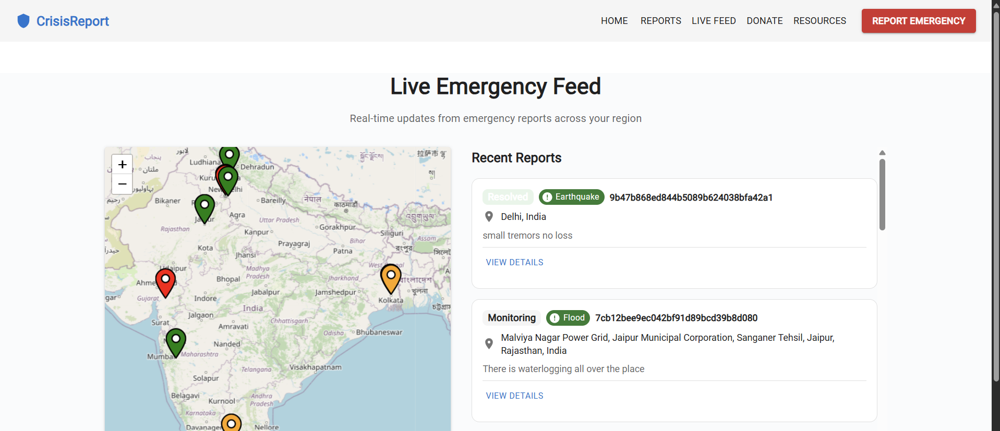
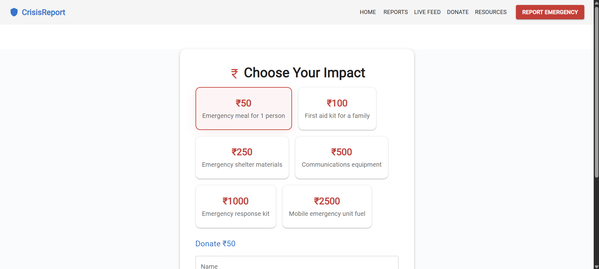
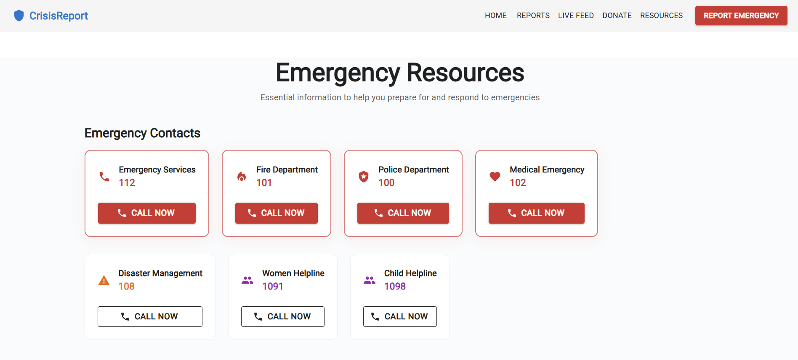

# 🚨 CrisisReport – Crowdsourced Disaster Reporting Platform

CrisisReport is a responsive, full-stack web application designed to empower communities during emergencies. It enables users to report disasters in real time, access live feeds, donate to verified causes, get essential resources, and contact emergency services — all in one unified platform.

---

## 📂 Project Overview

This project is built using **React.js** on the frontend. It follows a modular and scalable architecture, making it easy to maintain and extend. It’s ideal for students, contributors, and developers who want to build socially impactful applications.

---

## 🛠️ Getting Started

To set up this project locally, follow the steps below:

### 1. Clone the Repository

```bash
git clone https://github.com/your-username/CrisisReport.git
cd CrisisReport
````

### 2. Install Dependencies

```bash
npm install
```

### 3. Run the Application in Development Mode

```bash
npm start
```

This will launch the app on:
👉 `http://localhost:3000`

The app supports hot reloading, so any changes you make will reflect instantly in your browser.

---

## 🧪 Running Tests

To start the test runner in interactive watch mode:

```bash
npm test
```

You can write unit and component tests to ensure the app behaves as expected.

---

## ⚙️ Building for Production

To create an optimized and minified production build:

```bash
npm run build
```

This creates a `build/` folder with all assets optimized and hashed, ready for deployment.

---

## 🚨 Ejecting (Advanced Use Only)

```bash
npm run eject
```

> ⚠️ This is a permanent operation. Ejecting gives you full control over the configuration but removes the simplicity of Create React App. Proceed only if you need deep customization (e.g., modifying webpack, Babel, etc.).

---

## 🖼️ Application Screenshots

| Home Page                  | Report Page                |
| -------------------------- | -------------------------- |
|  |  |

| Live Feed                  | Donation Page                  |
| -------------------------- | ------------------------------ |
|  |  |

| Resources Page              |
| --------------------------- |
|  |

> Make sure these images are available in the repository directory where the README file exists. You can also store them in an `/assets` or `/images` folder if preferred.

---

## 🛠️ Troubleshooting Common Issues

### `npm run build` fails to minify

* This typically occurs if you’re using modern JavaScript features not supported by your version of `react-scripts`.
* Make sure all dependencies are up-to-date and compatible.

---

## ✅ Features at a Glance

* 🆘 **Disaster Reporting** – Real-time submission of disaster events.
* 📡 **Live Feed** – Continuous updates from verified users and sources.
* 💸 **Donation Portal** – Redirects to safe, secure donation platforms.
* 📚 **Resource Guide** – Access government guidelines and emergency numbers.
* 📞 **One-Tap Emergency Calls** – Direct call buttons for fire, ambulance, and police.

---

## 🙌 Contributing

Pull requests are welcome. For major changes, please open an issue first to discuss what you would like to change.

Please make sure to update tests as appropriate.

---

## 📄 License

This project is licensed under the MIT License — feel free to use, fork, and share with attribution.

---

## 📬 Contact

For queries or contributions, feel free to reach out:
**Author**: Dhruv Mendiratta
**Email**: \[[your-email@example.com](mailto:your-email@example.com)]
**LinkedIn**: \[your-profile]

---

```

Let me know:
- If you want to include backend details (if any),
- If your images are in a subfolder like `./assets/`,
- Or if you'd like this exported as a **README.pdf** too!

I'll update it accordingly.
```
